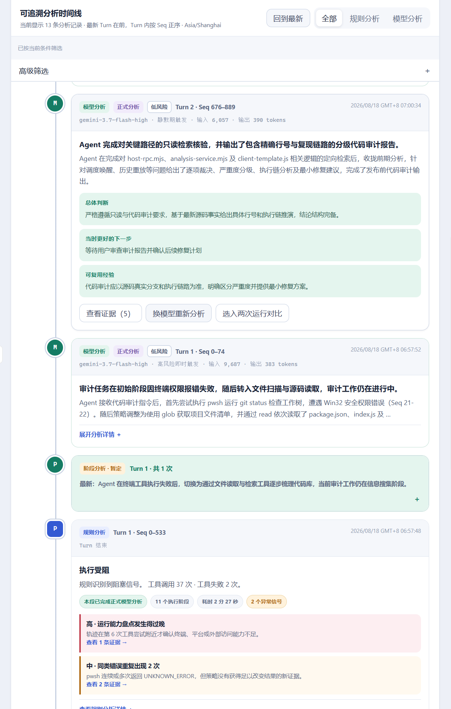
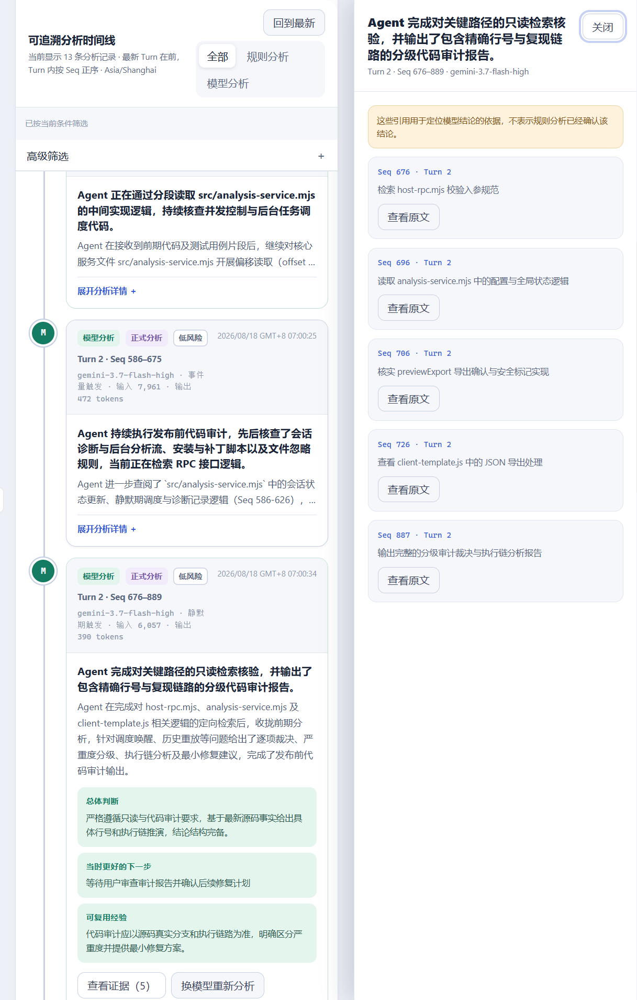
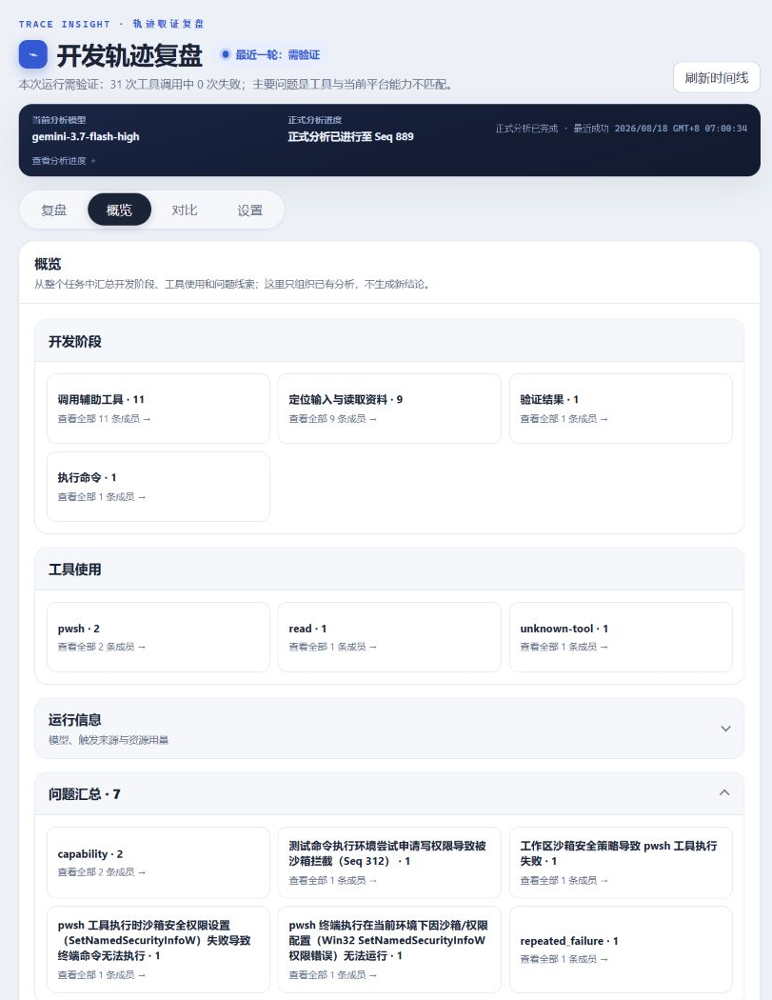
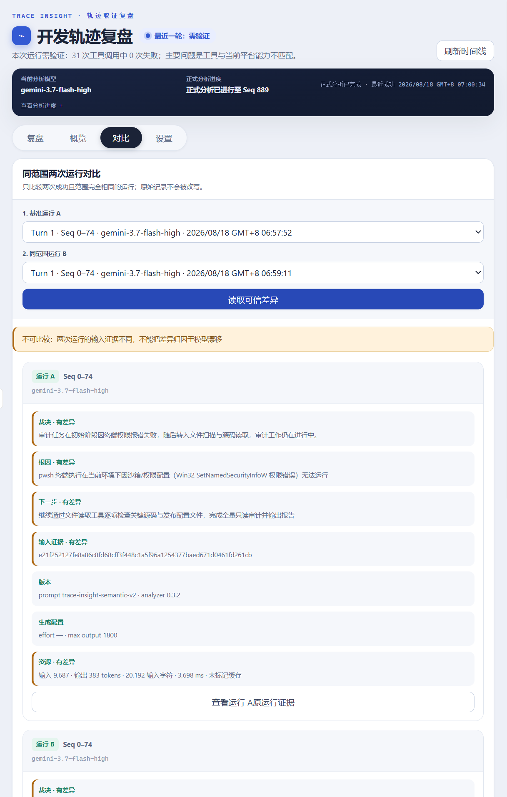

# DSH Trace Insight｜DSH 轨迹解读器

     

面向 DeepSeek Harness（DSH）的只读执行复盘插件。它把密集的轨迹事件整理成持续更新的分析时间线，帮助你看清 Agent 做了什么、哪里出错、为什么出错，以及结论对应哪些原始证据。

[English](README.en.md)



## 它解决什么问题

DSH 原生轨迹记录了消息、工具调用和事件，但长任务往往包含成百上千个步骤，单靠逐条翻阅很难回答这些问题：

- Agent 实际采用了什么策略？
- 哪些步骤真正推进了任务，哪些是重复试探？
- 失败来自模型判断、工具使用、环境条件还是输入缺失？
- 一段“已经完成”的回答是否有足够证据支撑？
- 长时间运行的一轮中，目前已经发生了什么？

Trace Insight 直接读取 DSH 的结构化 Session Event Log，用本地规则分析建立事实底座，再按需使用独立模型解释决策、风险和改进方向。

## 主要功能

- **持续复盘**：按 Turn 和 Seq 整理规则分析与模型分析，长任务不必等到整轮结束才看到阶段进展。
- **规则分析**：在本机识别工具失败、重复失败、无进展循环、路径猜测、工具误用、完成信号和证据缺口，不调用模型。
- **模型解读**：使用独立配置的 DSH 模型分析策略、根因、风险、下一步和可复用经验，不改变开发 Agent 的主模型。
- **证据定位**：从结论回到对应的 Seq、Turn、Step、Tool、摘录和原始前后文。
- **任务概览**：按开发阶段、工具使用和问题线索汇总整个任务，并可回到成员记录。
- **结果对比**：比较同一段轨迹的两次模型分析，观察不同模型或配置给出的差异。
- **受控重分析**：可以为指定区间临时切换模型重新分析，不改变以后自动分析使用的默认模型。
- **历史与导出**：分析记录保存在本机，可分别导出分析历史、原始 Session 历史或完整分析包。

## 界面

DSH 的对话或轨迹保留在左侧，Trace Insight 显示在可调整宽度的右侧栏中，原始执行过程和解读结果可以同时查看。

右侧栏包含四个页面：

- **复盘**：查看按时间排列的规则分析和模型分析。
- **概览**：查看整个任务的阶段、工具和问题汇总。
- **对比**：比较同一轨迹区间的两次成功分析。
- **设置**：配置分析模型、自动分析策略、资源限制和导出。

### 证据定位

模型结论和规则发现可以打开独立证据抽屉。每条引用都会标出 Seq、Turn 和摘要，需要时再读取对应的原始前后文。



### 任务概览

概览按开发阶段、工具使用和问题线索汇总整个 Session。汇总只整理已有分析，不会产生新的模型调用。



### 两次运行对比

对比只接受范围和输入一致的两次成功分析，分别展示结论、配置、资源用量和原始证据。



## 安装

需要全局安装 DeepSeek Harness `0.1.0-rc.7` 或 `0.1.0-rc.8`，并使用 Node.js `22.19.0` 或更高版本。安装前请关闭正在运行的 DSH。

下载或克隆本仓库后，在仓库根目录执行对应的安装程序。安装程序会检查当前全局 DSH、安装 Trace Insight，并接入右侧栏。

### Windows

双击 `安装到DSH.cmd`，或在 PowerShell 中运行：

```powershell
powershell -ExecutionPolicy Bypass -File .\install.ps1
```

### macOS 或 Linux

```bash
bash ./install.sh
```

安装完成后启动 DSH：

```shell
dsh web
```

打开任意会话后，点击 **解读** 即可打开右侧栏。

## 第一次使用

1. 打开任意 DSH 会话，点击 **解读**。
2. 进入 **复盘**。规则分析会直接读取现有轨迹，不需要配置模型。
3. 如需模型解读，进入 **设置 → 模型与自动策略**，选择 DSH 已注册的 provider 和模型。
4. 保存后，可以等待自动分析触发，也可以在复盘中选择一段轨迹手动分析。
5. 点击分析结论中的证据入口，查看对应原始事件和前后文。

打开或刷新 Trace Insight、筛选时间线、查看证据、进入概览或对比已有分析都不会触发模型调用。

## 模型与自动分析

Trace Insight 的分析模型与开发 Agent 的主模型相互独立。你可以设置：

- 全局默认模型；
- 当前 Session 专用模型；
- 仅本次分析临时使用的模型。

只有前两项会保存。临时选择其他模型不会修改以后自动分析使用的默认配置。

自动分析只会在 Session 已被实时执行纳入观察、已配置默认模型并满足触发条件时运行。模型失败、取消或返回无效结果时，分析进度不会越过该区间。

## 数据保存与导出

默认数据目录：

| 平台 | 路径 |
| --- | --- |
| Windows | `%USERPROFILE%\.dsh\trace-insight` |
| macOS / Linux | `$HOME/.dsh/trace-insight` |

如果设置了 `DSH_HOME`，数据目录为 `<DSH_HOME>/trace-insight`。目录中主要包含：

```text
settings.json
sessions/<session-id-hash>.json
```

可导出的内容分为：

- **分析历史**：规则分析、模型分析、运行状态和分析进度；
- **原始 Session 历史**：DSH 原始事件、surface 与会话谱系；
- **完整分析包**：同时包含分析历史和原始 Session 历史。

导出原始历史或完整分析包时需要再次确认。分析历史也可能包含证据摘录和模型原文，共享前请先检查内容。

## 只读、隐私与费用

- 不修改被检查的 Session、工作区、Skill 或全局记忆。
- 不干预、不暂停、不阻断开发 Agent 的执行。
- 规则分析完全在本机运行，不调用模型。
- 只有自动分析或用户主动发起模型分析时才会产生模型请求。
- 模型输入使用经过裁剪和常见凭证脱敏的轨迹证据，不会发送完整原始日志。
- 使用外部模型时，相应证据会发送给你选择的模型供应商。
- 原始 Session 数据默认不会包含在普通分析导出中。

## 卸载

卸载前请关闭正在运行的 DSH。

### Windows

双击 `卸载插件.cmd`，或在 PowerShell 中运行：

```powershell
powershell -ExecutionPolicy Bypass -File .\uninstall.ps1
```

### macOS 或 Linux

```bash
bash ./uninstall.sh
```

卸载程序会同时移除 Trace Insight 和右侧栏。已经保存的分析历史会保留在数据目录中。

## 常见问题

### 安装程序提示 DSH 正在运行

关闭 DSH 的终端或窗口，然后重新运行安装程序。

### 看不到“解读”入口或右侧栏

先完全关闭 DSH，再重新运行安装程序并启动 DSH。如果入口仍未出现，可以检查插件是否进入 `web` profile：

Windows PowerShell：

```powershell
dsh --profile web --dump-config | Select-String "trace-insight"
```

macOS 或 Linux：

```bash
dsh --profile web --dump-config | grep "trace-insight"
```

### 显示“等待默认模型”

规则分析仍会继续运行。进入 **设置 → 模型与自动策略**，选择 DSH 已注册的模型并保存即可。

### 模型分析失败

失败记录会保留，分析进度不会跳过失败区间。请检查 provider 凭证、模型路由和限流状态，再从失败区间重试或换模型复查。

### 通过局域网地址打开 DSH 时无法读取数据

Trace Insight Host RPC 仅允许 loopback 页面访问。请在运行 DSH 的同一台机器上通过 `127.0.0.1` 或 `localhost` 使用。

## 许可证

[MIT License](LICENSE)
